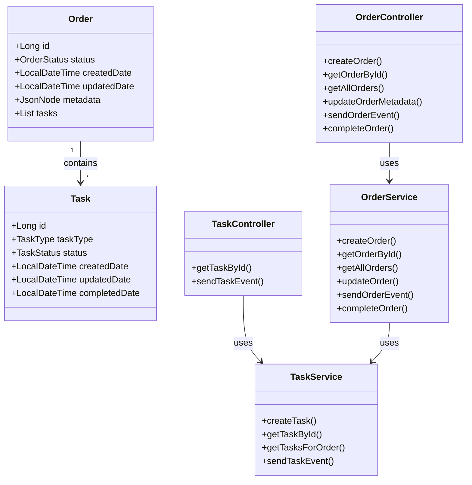
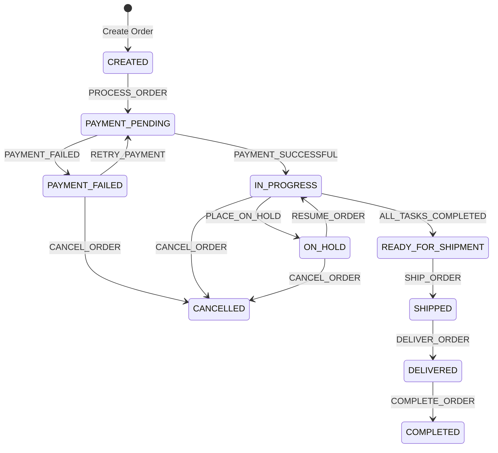
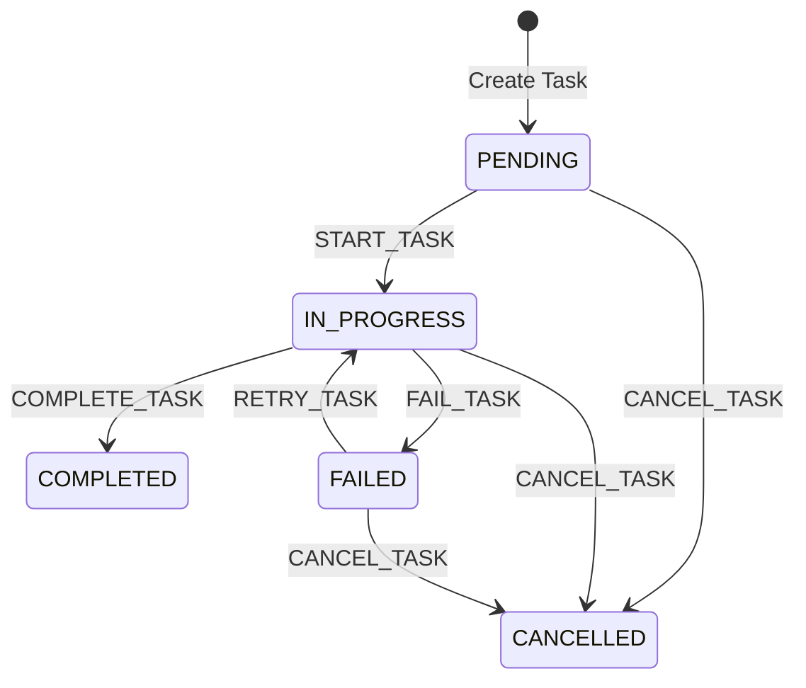

# Order Processing Workflow System

A Spring Boot application that implements a sophisticated order processing system with state machine-based workflow management. The system handles orders and their associated tasks, managing state transitions and providing a RESTful API interface.

## Architecture

### Class Diagram



### State Machine Diagram



### Task State Machine



## Features

- **Order Management**

  - Create and track orders with JSON metadata support
  - State machine-based workflow management
  - Task creation and management
  - Event-driven state transitions

- **Task Management**

  - Multiple task types (VALIDATE_ORDER_DETAILS, PROCESS_PAYMENT, etc.)
  - Independent state machine for each task
  - Task completion tracking
  - Event-based task state management

- **API Endpoints**
  - RESTful API for order and task management
  - Event endpoints for state transitions
  - Comprehensive error handling
  - DTO-based request/response handling

## Technology Stack

- **Framework**: Spring Boot 3.2.3
- **Database**: PostgreSQL with JSONB support
- **State Management**: Spring State Machine
- **Build Tool**: Maven
- **Documentation**: OpenAPI/Swagger (TODO)
- **Testing**: JUnit, Spring Boot Test

## Getting Started

### Prerequisites

- JDK 17 or later
- Maven 3.6 or later
- PostgreSQL 12 or later

### Configuration

The application uses different property files for different environments:

1. `application.properties`: Common configurations
2. `application-local.properties`: Local development settings (git-ignored)
3. `application.properties.example`: Template for production settings

To run locally:

1. Copy `application.properties.example` to `application-local.properties`
2. Update database credentials in `application-local.properties`
3. Set active profile to local:
   ```bash
   export SPRING_PROFILES_ACTIVE=local
   ```

### Building and Running

```bash
# Build the project
mvn clean install

# Run the application
mvn spring-boot:run
```

## API Documentation

### Order Endpoints

- `POST /api/v1/orders` - Create a new order
- `GET /api/v1/orders/{orderId}` - Get order by ID
- `GET /api/v1/orders` - Get all orders
- `PUT /api/v1/orders/{orderId}` - Update order metadata
- `POST /api/v1/orders/{orderId}/event` - Send order event
- `POST /api/v1/orders/{orderId}/complete` - Complete order

### Task Endpoints

- `GET /api/v1/tasks/{taskId}` - Get task by ID
- `POST /api/v1/tasks/{taskId}/event` - Send task event
- `GET /api/v1/orders/{orderId}/tasks` - Get tasks for order

## Database Schema

```sql
CREATE TABLE orders (
    id BIGSERIAL PRIMARY KEY,
    status VARCHAR(50) NOT NULL,
    created_date TIMESTAMP NOT NULL,
    updated_date TIMESTAMP NOT NULL,
    metadata JSONB
);

CREATE TABLE tasks (
    id BIGSERIAL PRIMARY KEY,
    order_id BIGINT NOT NULL,
    task_type VARCHAR(50) NOT NULL,
    status VARCHAR(50) NOT NULL,
    created_date TIMESTAMP NOT NULL,
    updated_date TIMESTAMP NOT NULL,
    completed_date TIMESTAMP,
    CONSTRAINT fk_task_order FOREIGN KEY (order_id) REFERENCES orders(id)
);
```

## Contributing

1. Fork the repository
2. Create a feature branch
3. Commit your changes
4. Push to the branch
5. Create a Pull Request

## License

This project is licensed under the MIT License - see the LICENSE file for details.
