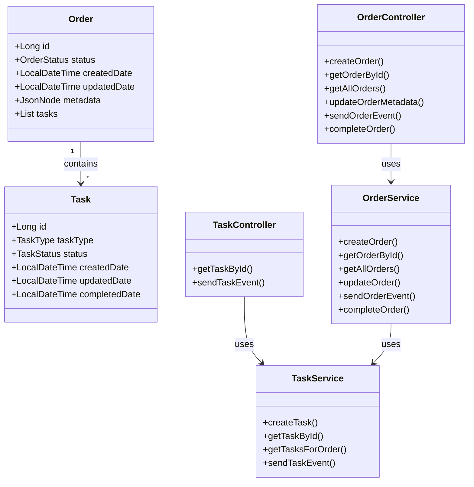
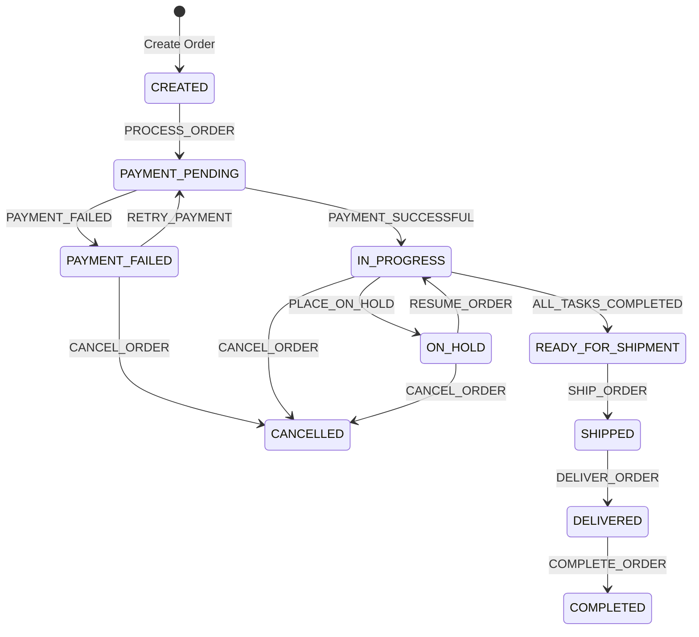
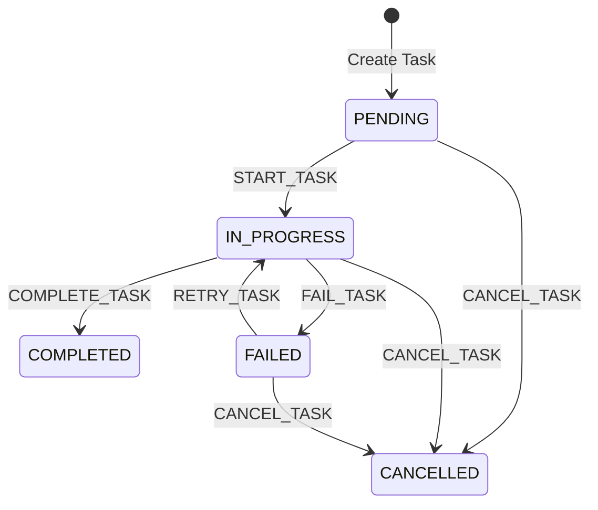
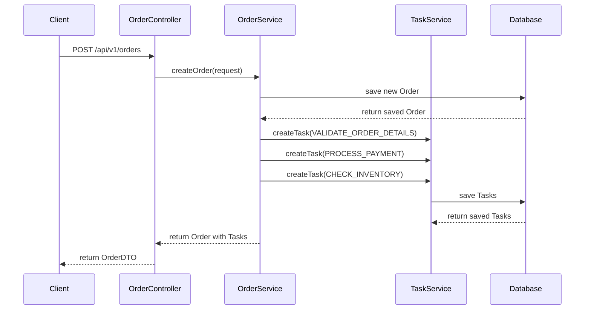

# System Architecture Diagrams

## Class Diagram

```mermaid
classDiagram
    class Order {
        +Long id
        +OrderStatus status
        +LocalDateTime createdDate
        +LocalDateTime updatedDate
        +JsonNode metadata
        +List<Task> tasks
    }

    class Task {
        +Long id
        +TaskType taskType
        +TaskStatus status
        +LocalDateTime createdDate
        +LocalDateTime updatedDate
        +LocalDateTime completedDate
    }

    class OrderController {
        +createOrder()
        +getOrderById()
        +getAllOrders()
        +updateOrderMetadata()
        +sendOrderEvent()
        +completeOrder()
    }

    class TaskController {
        +getTaskById()
        +sendTaskEvent()
    }

    class OrderService {
        +createOrder()
        +getOrderById()
        +getAllOrders()
        +updateOrder()
        +sendOrderEvent()
        +completeOrder()
    }

    class TaskService {
        +createTask()
        +getTaskById()
        +getTasksForOrder()
        +sendTaskEvent()
    }

    Order "1" --> "*" Task : contains
    OrderController --> OrderService : uses
    TaskController --> TaskService : uses
    OrderService --> TaskService : uses
```

## Order State Machine Diagram

```mermaid
stateDiagram-v2
    [*] --> CREATED: Create Order
    CREATED --> PAYMENT_PENDING: PROCESS_ORDER
    PAYMENT_PENDING --> PAYMENT_FAILED: PAYMENT_FAILED
    PAYMENT_PENDING --> IN_PROGRESS: PAYMENT_SUCCESSFUL
    PAYMENT_FAILED --> PAYMENT_PENDING: RETRY_PAYMENT
    PAYMENT_FAILED --> CANCELLED: CANCEL_ORDER
    IN_PROGRESS --> ON_HOLD: PLACE_ON_HOLD
    ON_HOLD --> IN_PROGRESS: RESUME_ORDER
    IN_PROGRESS --> READY_FOR_SHIPMENT: ALL_TASKS_COMPLETED
    READY_FOR_SHIPMENT --> SHIPPED: SHIP_ORDER
    SHIPPED --> DELIVERED: DELIVER_ORDER
    DELIVERED --> COMPLETED: COMPLETE_ORDER
    IN_PROGRESS --> CANCELLED: CANCEL_ORDER
    ON_HOLD --> CANCELLED: CANCEL_ORDER
```

## Task State Machine Diagram

```mermaid
stateDiagram-v2
    [*] --> PENDING: Create Task
    PENDING --> IN_PROGRESS: START_TASK
    IN_PROGRESS --> COMPLETED: COMPLETE_TASK
    IN_PROGRESS --> FAILED: FAIL_TASK
    FAILED --> IN_PROGRESS: RETRY_TASK
    PENDING --> CANCELLED: CANCEL_TASK
    IN_PROGRESS --> CANCELLED: CANCEL_TASK
    FAILED --> CANCELLED: CANCEL_TASK
```

## Sequence Diagram: Order Creation Flow

```mermaid
sequenceDiagram
    participant Client
    participant OrderController
    participant OrderService
    participant TaskService
    participant Database

    Client->>OrderController: POST /api/v1/orders
    OrderController->>OrderService: createOrder(request)
    OrderService->>Database: save new Order
    Database-->>OrderService: return saved Order
    OrderService->>TaskService: createTask(VALIDATE_ORDER_DETAILS)
    OrderService->>TaskService: createTask(PROCESS_PAYMENT)
    OrderService->>TaskService: createTask(CHECK_INVENTORY)
    TaskService->>Database: save Tasks
    Database-->>TaskService: return saved Tasks
    OrderService-->>OrderController: return Order with Tasks
    OrderController-->>Client: return OrderDTO
```
